# WeatherPy
----

#### Note
* Instructions have been included for each segment. You do not have to follow them exactly, but they are included to help you think through the steps.


```python
# Dependencies and Setup
import matplotlib.pyplot as plt
import pandas as pd
import numpy as np
import requests
import time
from scipy import stats
from pprint import pprint 
from datetime import datetime

# Import API key
from api_keys import weather_api_key

# Incorporated citipy to determine city based on latitude and longitude
from citipy import citipy

# Output File (CSV)
output_data_file = "output_data/cities.csv"

# Range of latitudes and longitudes
lat_range = (-90, 90)
lng_range = (-180, 180)
```

## Generate Cities List


```python
# List for holding lat_lngs and cities
lat_lngs = []
cities = []

# Create a set of random lat and lng combinations
lats = np.random.uniform(lat_range[0], lat_range[1], size=1500)
lngs = np.random.uniform(lng_range[0], lng_range[1], size=1500)
lat_lngs = zip(lats, lngs)

# Identify nearest city for each lat, lng combination
for lat_lng in lat_lngs:
    city = citipy.nearest_city(lat_lng[0], lat_lng[1]).city_name
    
    # If the city is unique, then add it to a our cities list
    if city not in cities:
        cities.append(city)

# Print the city count to confirm sufficient count
len(cities)

```


    613


### Perform API Calls
* Perform a weather check on each city using a series of successive API calls.
* Include a print log of each city as it'sbeing processed (with the city number and city name).


```python
# #TEST CODE - WORKS
# base_url = "http://api.openweathermap.org/data/2.5/weather?"

# units = "imperial"
# x = "Seoul"
# base_url = "http://api.openweathermap.org/data/2.5/weather?"
# query_url = f"{base_url}appid={weather_api_key}&units={units}&q="
# response = requests.get(query_url + x).json()
# pprint(response)

```


```python
#LOOP CODE - KEY ERROR on api response dictionary keys

# Create variables for API get
units = "imperial"
base_url = "http://api.openweathermap.org/data/2.5/weather?"
query_url = f"{base_url}appid={weather_api_key}&units={units}&q="
    
# Create empty lists to hold data from API get
city = []
lat = []
lng = []
max_temp = []
humidity = []
cloudiness = []
wind_speed = []
country = []
date = []

# Run loop with try/except to skip over cities not in Open Weather data
for index, x in enumerate(cities):
    try:
        response = requests.get(query_url + x).json()
        city.append(response['name'])
        lat.append(response['coord']['lat'])
        lng.append(response['coord']['lon'])
        max_temp.append(response['main']['temp_max'])
        humidity.append(response['main']['humidity'])               
        cloudiness.append(response['clouds']['all'])
        wind_speed.append(response['wind']['speed'])
        country.append(response['sys']['country'])
        date.append(response['dt'])
        print(f"Processing Record {index}| {x}")
        
    except (KeyError, IndexError):
        print("City not found. Skipping...")


```

    Processing Record 0| nianzishan
    Processing Record 1| bluff
    Processing Record 2| awbari
    Processing Record 3| nowy dwor gdanski
    Processing Record 4| hithadhoo
    Processing Record 5| lasa
    Processing Record 6| christchurch
    Processing Record 7| clarence town
    Processing Record 8| kahului
    Processing Record 9| naze
    Processing Record 10| vysokogornyy
    Processing Record 11| albany
    Processing Record 12| nikolskoye
    Processing Record 13| vaini
    Processing Record 14| altay
    Processing Record 15| atuona
    City not found. Skipping...
    City not found. Skipping...
    Processing Record 18| jobabo
    Processing Record 19| portland
    Processing Record 20| rikitea
    Processing Record 21| lander
    Processing Record 22| severo-kurilsk
    Processing Record 23| bathsheba
    Processing Record 24| georgetown
    Processing Record 25| ushuaia
    Processing Record 26| cockburn town
    City not found. Skipping...
    Processing Record 28| nanortalik
    Processing Record 29| tiksi
    Processing Record 30| broken hill
    Processing Record 31| kodiak
    Processing Record 32| ribeira grande
    Processing Record 33| hobart
    Processing Record 34| cape town
    Processing Record 35| busselton
    Processing Record 36| punta arenas
    Processing Record 37| khatanga
    Processing Record 38| iquitos
    Processing Record 39| airai
    Processing Record 40| grindavik
    Processing Record 41| hermanus
    City not found. Skipping...
    Processing Record 43| saint-francois
    Processing Record 44| yar-sale
    Processing Record 45| oussouye
    Processing Record 46| pundaguitan
    Processing Record 47| mataura
    Processing Record 48| yarada
    Processing Record 49| butaritari
    Processing Record 50| tasiilaq
    Processing Record 51| nogliki
    Processing Record 52| barrow
    Processing Record 53| yanagawa
    Processing Record 54| huarmey
    Processing Record 55| narsaq
    City not found. Skipping...
    Processing Record 57| bethel
    Processing Record 58| chokurdakh
    Processing Record 59| hofn
    Processing Record 60| karratha
    Processing Record 61| arraial do cabo
    Processing Record 62| namatanai
    Processing Record 63| bredasdorp
    Processing Record 64| yellowknife
    Processing Record 65| saint-joseph
    City not found. Skipping...
    Processing Record 67| neryungri
    Processing Record 68| riohacha
    Processing Record 69| torbay
    Processing Record 70| kapaa
    Processing Record 71| englehart
    Processing Record 72| puerto ayora
    Processing Record 73| upernavik
    Processing Record 74| sambava
    Processing Record 75| aranos
    Processing Record 76| vila franca do campo
    Processing Record 77| faya
    City not found. Skipping...
    Processing Record 79| jamestown
    Processing Record 80| saskylakh
    Processing Record 81| kamaishi
    Processing Record 82| tomatlan
    Processing Record 83| faanui
    Processing Record 84| boyolangu
    City not found. Skipping...
    City not found. Skipping...
    Processing Record 87| half moon bay
    Processing Record 88| ha tinh
    Processing Record 89| pecos
    Processing Record 90| lebu
    Processing Record 91| sao filipe
    Processing Record 92| adrar
    Processing Record 93| bratsk
    Processing Record 94| victoria
    Processing Record 95| dovolnoye
    Processing Record 96| castro
    Processing Record 97| new norfolk
    Processing Record 98| hovd
    Processing Record 99| saldanha
    Processing Record 100| dikson
    Processing Record 101| ngama
    Processing Record 102| ponta do sol
    Processing Record 103| taltal
    Processing Record 104| haverfordwest
    Processing Record 105| laguna
    Processing Record 106| penzance
    Processing Record 107| isabela
    Processing Record 108| lusambo
    Processing Record 109| petropavlovsk-kamchatskiy
    Processing Record 110| chama
    Processing Record 111| longyearbyen
    Processing Record 112| fortuna
    Processing Record 113| zheleznodorozhnyy
    Processing Record 114| brae
    Processing Record 115| yumen
    Processing Record 116| carnarvon
    Processing Record 117| hearst
    Processing Record 118| kushiro
    Processing Record 119| seymchan
    Processing Record 120| tazovskiy
    Processing Record 121| bam
    Processing Record 122| klaksvik
    Processing Record 123| broome
    Processing Record 124| lompoc
    Processing Record 125| taos
    Processing Record 126| harper
    Processing Record 127| zhangye
    Processing Record 128| teguldet
    Processing Record 129| ilulissat
    Processing Record 130| kaeo
    Processing Record 131| svetlogorsk
    Processing Record 132| provideniya
    City not found. Skipping...
    Processing Record 134| port hardy
    Processing Record 135| mount gambier
    Processing Record 136| srednekolymsk
    Processing Record 137| iqaluit
    Processing Record 138| ostrovnoy
    Processing Record 139| rawson
    Processing Record 140| hualmay
    Processing Record 141| korla
    Processing Record 142| ketchikan
    Processing Record 143| goderich
    Processing Record 144| saint-prosper
    Processing Record 145| tari
    Processing Record 146| berlevag
    Processing Record 147| port elizabeth
    Processing Record 148| tuatapere
    Processing Record 149| hami
    Processing Record 150| grudziadz
    Processing Record 151| hilo
    Processing Record 152| san patricio
    Processing Record 153| langsa
    Processing Record 154| caravelas
    City not found. Skipping...
    Processing Record 156| flinders
    City not found. Skipping...
    Processing Record 158| fairbanks
    Processing Record 159| tual
    Processing Record 160| pevek
    Processing Record 161| luderitz
    Processing Record 162| khashuri
    Processing Record 163| yuty
    Processing Record 164| smithers
    Processing Record 165| ahuimanu
    Processing Record 166| tigil
    Processing Record 167| antalaha
    Processing Record 168| forio
    Processing Record 169| saint george
    Processing Record 170| hasaki
    Processing Record 171| clyde river
    Processing Record 172| talnakh
    Processing Record 173| catabola
    Processing Record 174| wageningen
    Processing Record 175| orhangazi
    Processing Record 176| ezequiel montes
    Processing Record 177| ust-kuyga
    City not found. Skipping...
    Processing Record 179| spasskoye
    Processing Record 180| kangalassy
    Processing Record 181| loanda
    Processing Record 182| san quintin
    Processing Record 183| saint-louis
    Processing Record 184| gazli
    Processing Record 185| voskresenskoye
    Processing Record 186| mar del plata
    Processing Record 187| thompson
    Processing Record 188| oktyabrskiy
    Processing Record 189| qabaqcol
    Processing Record 190| zyryanskoye
    City not found. Skipping...
    Processing Record 192| geraldton
    Processing Record 193| constitucion
    City not found. Skipping...
    Processing Record 195| tongliao
    Processing Record 196| waingapu
    Processing Record 197| samana
    Processing Record 198| lagoa
    Processing Record 199| bengkulu
    Processing Record 200| avarua
    Processing Record 201| los negros
    City not found. Skipping...
    Processing Record 203| luwuk
    Processing Record 204| toamasina
    Processing Record 205| mwinilunga
    Processing Record 206| tortoli
    Processing Record 207| ambulu
    Processing Record 208| cidreira
    Processing Record 209| guerrero negro
    Processing Record 210| coquimbo
    Processing Record 211| ambilobe
    Processing Record 212| methoni
    Processing Record 213| miramar
    Processing Record 214| vanimo
    City not found. Skipping...
    Processing Record 216| bollnas
    Processing Record 217| cubuk
    Processing Record 218| kuching
    Processing Record 219| tarrega
    Processing Record 220| nuevo progreso
    Processing Record 221| rundu
    City not found. Skipping...
    Processing Record 223| sur
    Processing Record 224| saint-philippe
    Processing Record 225| kaseda
    Processing Record 226| guaruja
    Processing Record 227| kiama
    Processing Record 228| ormara
    Processing Record 229| kaitangata
    Processing Record 230| vyazovaya
    Processing Record 231| bambous virieux
    Processing Record 232| derac
    Processing Record 233| micheweni
    Processing Record 234| wamba
    Processing Record 235| komsomolskiy
    Processing Record 236| zemio
    Processing Record 237| palmer
    Processing Record 238| cabo san lucas
    Processing Record 239| udachnyy
    Processing Record 240| pangnirtung
    Processing Record 241| murupara
    Processing Record 242| norman wells
    Processing Record 243| itapetininga
    Processing Record 244| hay river
    Processing Record 245| kruisfontein
    Processing Record 246| sarkand
    City not found. Skipping...
    Processing Record 248| baykit
    Processing Record 249| mahebourg
    Processing Record 250| port alfred
    Processing Record 251| banda aceh
    Processing Record 252| kutum
    Processing Record 253| camopi
    Processing Record 254| jinji
    Processing Record 255| requena
    City not found. Skipping...
    Processing Record 257| mareeba
    Processing Record 258| gympie
    Processing Record 259| nelson bay
    Processing Record 260| catia la mar
    Processing Record 261| gornopravdinsk
    City not found. Skipping...
    City not found. Skipping...
    Processing Record 264| kloulklubed
    Processing Record 265| amarante do maranhao
    Processing Record 266| dwarka
    Processing Record 267| salinopolis
    Processing Record 268| doka
    City not found. Skipping...
    Processing Record 270| cherskiy
    Processing Record 271| dingle
    City not found. Skipping...
    Processing Record 273| mao
    Processing Record 274| labuhan
    Processing Record 275| coihaique
    Processing Record 276| visnes
    Processing Record 277| juarez
    Processing Record 278| chuy
    Processing Record 279| new glasgow
    Processing Record 280| esperance
    Processing Record 281| handan
    Processing Record 282| alta floresta
    Processing Record 283| haines junction
    Processing Record 284| noumea
    Processing Record 285| pyaozerskiy
    Processing Record 286| santa cruz
    Processing Record 287| san juan
    Processing Record 288| khandagayty
    Processing Record 289| qaanaaq
    Processing Record 290| la ronge
    Processing Record 291| ogbomosho
    Processing Record 292| chara
    Processing Record 293| avera
    Processing Record 294| itaituba
    Processing Record 295| souillac
    Processing Record 296| vao
    Processing Record 297| olafsvik
    Processing Record 298| shingu
    Processing Record 299| kailua
    Processing Record 300| nemuro
    Processing Record 301| nantucket
    Processing Record 302| tutoia
    Processing Record 303| pemberton
    Processing Record 304| carballo
    Processing Record 305| beipiao
    Processing Record 306| lixourion
    Processing Record 307| kangshan
    Processing Record 308| halifax
    Processing Record 309| chone
    City not found. Skipping...
    Processing Record 311| kholm-zhirkovskiy
    Processing Record 312| abha
    Processing Record 313| derzhavinsk
    Processing Record 314| pacasmayo
    Processing Record 315| chester
    Processing Record 316| kudahuvadhoo
    Processing Record 317| maniitsoq
    Processing Record 318| gimli
    Processing Record 319| grants pass
    Processing Record 320| afantou
    Processing Record 321| diffa
    Processing Record 322| batagay
    City not found. Skipping...
    Processing Record 324| padang
    Processing Record 325| mirnyy
    Processing Record 326| sitka
    Processing Record 327| petrovsk-zabaykalskiy
    Processing Record 328| leshukonskoye
    Processing Record 329| suraabad
    Processing Record 330| lorengau
    Processing Record 331| bonavista
    Processing Record 332| diego de almagro
    Processing Record 333| rocha
    Processing Record 334| mount isa
    City not found. Skipping...
    Processing Record 336| los llanos de aridane
    Processing Record 337| itarema
    Processing Record 338| xiongzhou
    Processing Record 339| san vicente de canete
    Processing Record 340| tarata
    Processing Record 341| kieta
    Processing Record 342| elliot lake
    Processing Record 343| atherton
    Processing Record 344| tura
    Processing Record 345| malvern
    Processing Record 346| cumra
    Processing Record 347| kandrian
    Processing Record 348| praia da vitoria
    Processing Record 349| bilma
    Processing Record 350| sobolevo
    Processing Record 351| nanning
    City not found. Skipping...
    Processing Record 353| vestmanna
    Processing Record 354| rizomata
    Processing Record 355| springbok
    Processing Record 356| havelock
    Processing Record 357| bassar
    Processing Record 358| marsa matruh
    Processing Record 359| alofi
    Processing Record 360| mayo
    Processing Record 361| lewisburg
    City not found. Skipping...
    Processing Record 363| filingue
    Processing Record 364| chazuta
    Processing Record 365| gwadar
    Processing Record 366| necochea
    Processing Record 367| gambela
    Processing Record 368| eyl
    Processing Record 369| el alto
    Processing Record 370| san carlos de bariloche
    Processing Record 371| maltahohe
    City not found. Skipping...
    Processing Record 373| goma
    City not found. Skipping...
    Processing Record 375| popondetta
    Processing Record 376| taldan
    Processing Record 377| mayumba
    Processing Record 378| grand gaube
    Processing Record 379| te horo
    Processing Record 380| davila
    Processing Record 381| barabai
    Processing Record 382| quatre cocos
    Processing Record 383| kibungo
    Processing Record 384| iskateley
    Processing Record 385| kasempa
    Processing Record 386| chapais
    Processing Record 387| belyy yar
    Processing Record 388| vikhorevka
    City not found. Skipping...
    Processing Record 390| tautira
    Processing Record 391| sioux lookout
    Processing Record 392| sovata
    Processing Record 393| hambantota
    Processing Record 394| jalu
    Processing Record 395| sezana
    Processing Record 396| monte santo
    Processing Record 397| katsuura
    Processing Record 398| guntakal
    Processing Record 399| urmary
    Processing Record 400| te anau
    Processing Record 401| muravlenko
    Processing Record 402| evanston
    Processing Record 403| touros
    Processing Record 404| neyshabur
    Processing Record 405| liuzhou
    Processing Record 406| batemans bay
    Processing Record 407| betafo
    Processing Record 408| urumqi
    Processing Record 409| jonkoping
    Processing Record 410| dunedin
    Processing Record 411| athabasca
    Processing Record 412| toguchin
    Processing Record 413| mujiayingzi
    Processing Record 414| ardmore
    Processing Record 415| east london
    Processing Record 416| chipinge
    Processing Record 417| itoman
    Processing Record 418| tuktoyaktuk
    Processing Record 419| margate
    Processing Record 420| batsfjord
    Processing Record 421| chilca
    Processing Record 422| dera bugti
    Processing Record 423| verkhoyansk
    Processing Record 424| pombia
    Processing Record 425| tezu
    Processing Record 426| palauig
    Processing Record 427| gunnaur
    Processing Record 428| tadine
    Processing Record 429| bastrop
    Processing Record 430| nome
    Processing Record 431| rincon
    Processing Record 432| codrington
    Processing Record 433| pozarevac
    Processing Record 434| yurla
    Processing Record 435| niltepec
    Processing Record 436| auki
    Processing Record 437| amroha
    Processing Record 438| ancud
    Processing Record 439| bakel
    Processing Record 440| kimbe
    Processing Record 441| kununurra
    Processing Record 442| champerico
    Processing Record 443| jibuti
    Processing Record 444| keflavik
    Processing Record 445| haimen
    Processing Record 446| tieling
    Processing Record 447| japura
    Processing Record 448| bitburg
    Processing Record 449| araguaina
    Processing Record 450| vostok
    Processing Record 451| san carlos del zulia
    Processing Record 452| bandrele
    Processing Record 453| voronovytsya
    Processing Record 454| sola
    Processing Record 455| bogale
    Processing Record 456| makaha
    Processing Record 457| thinadhoo
    City not found. Skipping...
    Processing Record 459| groningen
    Processing Record 460| aripuana
    Processing Record 461| assiniboia
    Processing Record 462| poum
    Processing Record 463| kyaikkami
    Processing Record 464| cosamaloapan
    City not found. Skipping...
    Processing Record 466| strezhevoy
    Processing Record 467| lagos
    Processing Record 468| moyale
    City not found. Skipping...
    Processing Record 470| opuwo
    Processing Record 471| maceio
    Processing Record 472| guhagar
    Processing Record 473| darhan
    Processing Record 474| cabedelo
    Processing Record 475| chivay
    Processing Record 476| sarstedt
    Processing Record 477| kashiwazaki
    Processing Record 478| dembi dolo
    Processing Record 479| fenoarivo
    Processing Record 480| svetlaya
    Processing Record 481| alizai
    City not found. Skipping...
    Processing Record 483| leningradskiy
    Processing Record 484| prado
    Processing Record 485| damghan
    Processing Record 486| ilyich
    Processing Record 487| parit buntar
    Processing Record 488| najran
    Processing Record 489| weihai
    City not found. Skipping...
    Processing Record 491| nuuk
    Processing Record 492| cassilandia
    Processing Record 493| ouadda
    Processing Record 494| le port
    City not found. Skipping...
    Processing Record 496| adelaide
    Processing Record 497| taganak
    City not found. Skipping...
    Processing Record 499| labytnangi
    Processing Record 500| beringovskiy
    Processing Record 501| marzuq
    Processing Record 502| gigmoto
    Processing Record 503| parkersburg
    Processing Record 504| barras
    Processing Record 505| xuddur
    Processing Record 506| berdigestyakh
    Processing Record 507| dudinka
    Processing Record 508| aljezur
    Processing Record 509| moron
    Processing Record 510| bar harbor
    City not found. Skipping...
    Processing Record 512| agirish
    City not found. Skipping...
    Processing Record 514| xam nua
    Processing Record 515| yerbogachen
    Processing Record 516| comodoro rivadavia
    Processing Record 517| kamenka
    Processing Record 518| benghazi
    Processing Record 519| kankan
    Processing Record 520| kavieng
    Processing Record 521| taseyevo
    Processing Record 522| vaasa
    Processing Record 523| mehamn
    Processing Record 524| yeniseysk
    Processing Record 525| oksfjord
    Processing Record 526| port shepstone
    Processing Record 527| abalak
    Processing Record 528| zhanaozen
    Processing Record 529| bathurst
    Processing Record 530| monrovia
    Processing Record 531| bandarbeyla
    Processing Record 532| yining
    Processing Record 533| san jose
    Processing Record 534| usinsk
    Processing Record 535| alice springs
    Processing Record 536| bara
    Processing Record 537| vardo
    Processing Record 538| sanawad
    Processing Record 539| dolores
    Processing Record 540| verkhnevilyuysk
    Processing Record 541| shemgang
    Processing Record 542| murray bridge
    Processing Record 543| ornskoldsvik
    Processing Record 544| port hedland
    Processing Record 545| quchan
    Processing Record 546| college
    Processing Record 547| hamilton
    Processing Record 548| conakry
    Processing Record 549| acapulco
    Processing Record 550| kavaratti
    Processing Record 551| plettenberg bay
    Processing Record 552| santa barbara
    Processing Record 553| valdez
    Processing Record 554| russkaya polyana
    Processing Record 555| mannargudi
    Processing Record 556| turkan
    Processing Record 557| pacific grove
    Processing Record 558| chihuahua
    Processing Record 559| san andres
    Processing Record 560| meulaboh
    Processing Record 561| dicabisagan
    Processing Record 562| san cristobal
    Processing Record 563| soyo
    Processing Record 564| phek
    Processing Record 565| roma
    Processing Record 566| xingtai
    Processing Record 567| clarksville
    Processing Record 568| ahipara
    Processing Record 569| batticaloa
    Processing Record 570| nacala
    Processing Record 571| victor harbor
    Processing Record 572| namibe
    Processing Record 573| shubarkuduk
    Processing Record 574| saint-augustin
    Processing Record 575| saint-ambroise
    Processing Record 576| baruun-urt
    Processing Record 577| roebourne
    Processing Record 578| taksimo
    Processing Record 579| arroyo
    Processing Record 580| sri aman
    Processing Record 581| itanagar
    Processing Record 582| sibu
    Processing Record 583| bubaque
    Processing Record 584| hangu
    Processing Record 585| dzaoudzi
    Processing Record 586| bardiyah
    Processing Record 587| concarneau
    Processing Record 588| san-pedro
    City not found. Skipping...
    Processing Record 590| kangaatsiaq
    Processing Record 591| gorontalo
    Processing Record 592| axim
    Processing Record 593| tamworth
    Processing Record 594| taoudenni
    Processing Record 595| vagur
    Processing Record 596| saint anthony
    Processing Record 597| tygda
    Processing Record 598| salalah
    Processing Record 599| merrill
    Processing Record 600| cap malheureux
    City not found. Skipping...
    Processing Record 602| nakhon ratchasima
    Processing Record 603| arica
    Processing Record 604| beinamar
    Processing Record 605| petropavlovka
    Processing Record 606| yatsuo
    Processing Record 607| preeceville
    Processing Record 608| whitehorse
    Processing Record 609| pisco
    City not found. Skipping...
    Processing Record 611| celestun
    Processing Record 612| basoko


### Convert Raw Data to DataFrame
* Export the city data into a .csv.
* Display the DataFrame


```python
# Setup data frame

weather_dict = {
    "City": city,
    "Lat": lat,
    "Lng": lng,
    "Max Temp": max_temp,
    "Humidity": humidity,
    "Cloudiness": cloudiness,
    "WindSpeed": wind_speed,
    "Country": country,
    "Date": date
}

weather_data = pd.DataFrame(weather_dict)
weather_data.to_csv("./output/weather_data.csv")
weather_data

```


<div>
<style scoped>
    .dataframe tbody tr th:only-of-type {
        vertical-align: middle;
    }

    .dataframe tbody tr th {
        vertical-align: top;
    }

    .dataframe thead th {
        text-align: right;
    }
</style>
<table border="1" class="dataframe">
  <thead>
    <tr style="text-align: right;">
      <th></th>
      <th>City</th>
      <th>Lat</th>
      <th>Lng</th>
      <th>Max Temp</th>
      <th>Humidity</th>
      <th>Cloudiness</th>
      <th>WindSpeed</th>
      <th>Country</th>
      <th>Date</th>
    </tr>
  </thead>
  <tbody>
    <tr>
      <th>0</th>
      <td>Nianzishan</td>
      <td>47.52</td>
      <td>122.88</td>
      <td>56.05</td>
      <td>46</td>
      <td>4</td>
      <td>4.00</td>
      <td>CN</td>
      <td>1589042647</td>
    </tr>
    <tr>
      <th>1</th>
      <td>Bluff</td>
      <td>-46.60</td>
      <td>168.33</td>
      <td>52.68</td>
      <td>80</td>
      <td>30</td>
      <td>10.18</td>
      <td>NZ</td>
      <td>1589042058</td>
    </tr>
    <tr>
      <th>2</th>
      <td>Ubari</td>
      <td>26.59</td>
      <td>12.78</td>
      <td>96.85</td>
      <td>9</td>
      <td>0</td>
      <td>11.03</td>
      <td>LY</td>
      <td>1589042149</td>
    </tr>
    <tr>
      <th>3</th>
      <td>Nowy Dwór Gdański</td>
      <td>54.21</td>
      <td>19.12</td>
      <td>59.00</td>
      <td>58</td>
      <td>37</td>
      <td>6.93</td>
      <td>PL</td>
      <td>1589042648</td>
    </tr>
    <tr>
      <th>4</th>
      <td>Hithadhoo</td>
      <td>-0.60</td>
      <td>73.08</td>
      <td>85.14</td>
      <td>79</td>
      <td>100</td>
      <td>13.87</td>
      <td>MV</td>
      <td>1589041968</td>
    </tr>
    <tr>
      <th>...</th>
      <td>...</td>
      <td>...</td>
      <td>...</td>
      <td>...</td>
      <td>...</td>
      <td>...</td>
      <td>...</td>
      <td>...</td>
      <td>...</td>
    </tr>
    <tr>
      <th>564</th>
      <td>Preeceville</td>
      <td>51.95</td>
      <td>-102.67</td>
      <td>37.22</td>
      <td>75</td>
      <td>100</td>
      <td>7.45</td>
      <td>CA</td>
      <td>1589042584</td>
    </tr>
    <tr>
      <th>565</th>
      <td>Whitehorse</td>
      <td>60.72</td>
      <td>-135.05</td>
      <td>53.01</td>
      <td>45</td>
      <td>20</td>
      <td>2.24</td>
      <td>CA</td>
      <td>1589042793</td>
    </tr>
    <tr>
      <th>566</th>
      <td>Pisco</td>
      <td>-13.70</td>
      <td>-76.22</td>
      <td>71.01</td>
      <td>82</td>
      <td>30</td>
      <td>8.05</td>
      <td>PE</td>
      <td>1589042793</td>
    </tr>
    <tr>
      <th>567</th>
      <td>Celestún</td>
      <td>20.87</td>
      <td>-90.40</td>
      <td>88.32</td>
      <td>58</td>
      <td>86</td>
      <td>4.94</td>
      <td>MX</td>
      <td>1589042794</td>
    </tr>
    <tr>
      <th>568</th>
      <td>Basoko</td>
      <td>1.24</td>
      <td>23.62</td>
      <td>75.88</td>
      <td>80</td>
      <td>73</td>
      <td>2.98</td>
      <td>CD</td>
      <td>1589042794</td>
    </tr>
  </tbody>
</table>
<p>569 rows × 9 columns</p>
</div>


```python
# Set date of when data was pulled 

date = pd.to_datetime(weather_data['Date'], unit='s')
date = date.dt.strftime('%m/%d/%Y')
date = date.loc[0]
date
```


    '05/09/2020'


## Inspect the data and remove the cities where the humidity > 100%.
----
Skip this step if there are no cities that have humidity > 100%. 


```python
test = weather_data.drop(weather_data[weather_data['Humidity'] > 100].index)
len(test)

```


    569


```python
#  Get the indices of cities that have humidity over 100%.

```


```python
# Make a new DataFrame equal to the city data to drop all humidity outliers by index.
# Passing "inplace=False" will make a copy of the city_data DataFrame, which we call "clean_city_data".

```


```python
# Extract relevant fields from the data frame


# Export the City_Data into a csv

```

## Plotting the Data
* Use proper labeling of the plots using plot titles (including date of analysis) and axes labels.
* Save the plotted figures as .pngs.

## Latitude vs. Temperature Plot


```python
# Create scatter plot for Lat vs Temp
plt.scatter(weather_data['Lat'], weather_data['Max Temp'], color='red', alpha=.5, edgecolors='black')
plt.grid()
plt.xlabel('Latitude')
plt.ylabel('Max Temperature')
plt.title(f'Latitude vs. Temperature ({date})')
plt.savefig('./output/lat_vs_temp', format='png')
```


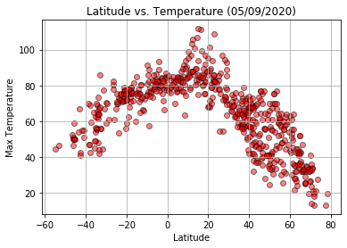


##### Latitude vs. Temperature Scatter Plot Analysis
Scatter plot shows a distinct curve. The highest temperatures at the peak of the curve are around 0 latitude, also known as the equator. Temperatures drop as the latitude goes up or down towards north and south poles.


## Latitude vs. Humidity Plot


```python
# Create scatter plot for Lat vs Humidity
plt.scatter(weather_data['Lat'], weather_data['Humidity'], alpha=.5, edgecolors='black')
plt.grid()
plt.xlabel('Latitude')
plt.ylabel('Humidity')
plt.title(f'Latitude vs Humidity ({date})')
plt.savefig('./output/lat_vs_humidity', format='png')
```


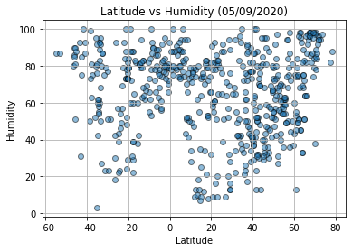


##### Latitude vs. Humidity Scatter Plot Analysis
Scatter plot shows high humidity across all latitudes with lower humidity around -20 latitude and 20-40 latitude. No lower humidity levels around the equator, only high humidity. 

## Latitude vs. Cloudiness Plot


```python
# Create scatter plot for Lat vs Cloudiness
plt.scatter(weather_data['Lat'], weather_data['Cloudiness'], color='grey', alpha=.5, edgecolors='black')
plt.grid()
plt.xlabel('Latitude')
plt.ylabel('Cloudiness')
plt.title(f'Latitude vs Cloudiness ({date})')
plt.savefig('./output/lat_vs_cloudiness', format='png')
```


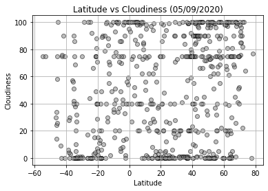


##### Latitude vs. Cloudiness Scatter Plot Analysis
Scatter plot shows fairly even levels of cloudiness across all latitudes with highest clusters of cities at same cloudiness at 0 and 100. 

## Latitude vs. Wind Speed Plot


```python
# Create scatter plot for Lat vs Wind Speed
plt.scatter(weather_data['Lat'], weather_data['WindSpeed'], color='purple', alpha=.5, edgecolors='black')
plt.grid()
plt.xlabel('Latitude')
plt.ylabel('Wind Speed')
plt.title(f'Latitude vs Wind Speed ({date})')
plt.savefig('./output/lat_vs_wind_speed', format='png')
```


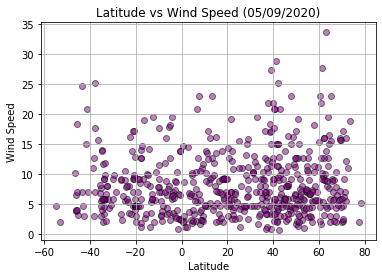


##### Latitude vs. Wind Speed Scatter Plot Analysis
Scatter plot shows fairly low and even wind speeds across all latitudes. 

## Linear Regression


```python
# OPTIONAL: Create a function to create Linear Regression plots
```


```python
# Create Northern and Southern Hemisphere DataFrames
northern_hemisphere = weather_data.where(weather_data['Lat'] > 0)
northern_hemisphere = northern_hemisphere.dropna()

southern_hemisphere = weather_data.where(weather_data['Lat'] < 0)
southern_hemisphere = southern_hemisphere.dropna()

```

####  Northern Hemisphere - Max Temp vs. Latitude Linear Regression


```python
# Set x and y values
x_values = northern_hemisphere['Lat']
y_values = northern_hemisphere['Max Temp']

# Calculate linear regression, line equation and r squared
(slope, intercept, rvalue, pvalue, stderr) = stats.linregress(x_values, y_values)
regress_values = x_values * slope + intercept
line_eq = "y = " + str(round(slope,2)) + "x + " + str(round(intercept,2))
r_squared = rvalue**2

# Create scatter plot with line equation
plt.scatter(x_values, y_values, color='red', alpha=.5, edgecolors='black')
plt.plot(x_values,regress_values,"r-")
plt.annotate(line_eq,(10,20),fontsize=15,color="red")
plt.grid()
plt.xlabel('Latitude')
plt.ylabel('Max Temperature')
plt.xlim(-5, 85)
plt.ylim(-10,110)
print(f"The r-squared is: {rvalue**2}")
plt.show()
```

    The r-squared is: 0.7052045484049414


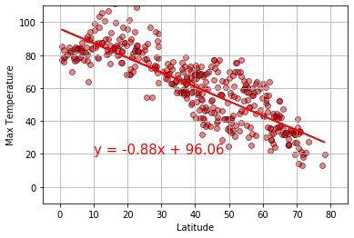


##### Latitude vs. Temperature Linear Regression (Northern Hemisphere) Analysis
Linear regression shows a very distinct linear relationship between temp and latitude: highest temps are near the equator and temps drop as latitude moves away from the equator. R-squared value is high.

####  Southern Hemisphere - Max Temp vs. Latitude Linear Regression


```python
# Set x and y values
x_values = southern_hemisphere['Lat']
y_values = southern_hemisphere['Max Temp']

# Calculate linear regression, line equation and r squared
(slope, intercept, rvalue, pvalue, stderr) = stats.linregress(x_values, y_values)
regress_values = x_values * slope + intercept
line_eq = "y = " + str(round(slope,2)) + "x + " + str(round(intercept,2))
r_squared = rvalue**2

# Create scatter plot with line equation
plt.scatter(x_values, y_values, color='red', alpha=.5, edgecolors='black')
plt.plot(x_values,regress_values,"r-")
plt.annotate(line_eq,(-50,15),fontsize=15,color="red")
plt.grid()
plt.xlabel('Latitude')
plt.ylabel('Max Temperature')
plt.ylim(-10,110)
print(f"The r-squared is: {rvalue**2}")
plt.show()
```

    The r-squared is: 0.622958334297178


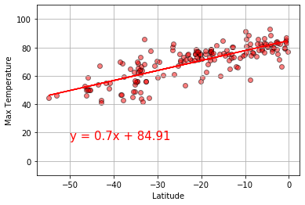


##### Latitude vs. Temperature Linear Regression (Southern Hemisphere) Analysis
Linear regression show distinct relationship again between temp and latitude: lowest temps are furthest away from the equator and highest temps near the equator. R-squared value is fairly high.

####  Northern Hemisphere - Humidity (%) vs. Latitude Linear Regression


```python
# Set x and y values
x_values = northern_hemisphere['Lat']
y_values = northern_hemisphere['Humidity']

# Calculate linear regression, line equation and r squared
(slope, intercept, rvalue, pvalue, stderr) = stats.linregress(x_values, y_values)
regress_values = x_values * slope + intercept
r_squared = rvalue**2

# Create scatter plot with line equation
plt.scatter(x_values, y_values, alpha=.5, edgecolors='black')
plt.plot(x_values,regress_values,"r-")
plt.annotate(line_eq,(45,20),fontsize=15,color="red")
plt.grid()
plt.xlabel('Latitude')
plt.ylabel('Humidity')
print(f"The r-squared is: {rvalue**2}")
plt.show()
```

    The r-squared is: 0.014296133345324846


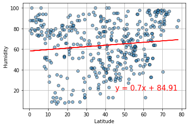


##### Latitude vs. Humidity Linear Regression (Northern Hemisphere) Analysis
Linear regression shows only slight relationship and r-squared value is very low, both indicating very little relationship between humidity and latitude. 

####  Southern Hemisphere - Humidity (%) vs. Latitude Linear Regression


```python
# Set x and y values
x_values = southern_hemisphere['Lat']
y_values = southern_hemisphere['Humidity']

# Calculate linear regression, line equation and r squared
(slope, intercept, rvalue, pvalue, stderr) = stats.linregress(x_values, y_values)
regress_values = x_values * slope + intercept
line_eq = "y = " + str(round(slope,2)) + "x + " + str(round(intercept,2))
r_squared = rvalue**2

# Create scatter plot with line equation
plt.scatter(x_values, y_values, alpha=.5, edgecolors='black')
plt.plot(x_values,regress_values,"r-")
plt.annotate(line_eq,(-55,20),fontsize=15,color="red")
plt.grid()
plt.xlabel('Latitude')
plt.ylabel('Humidity')
print(f"The r-squared is: {rvalue**2}")
plt.show()
```

    The r-squared is: 0.0028531790089921243


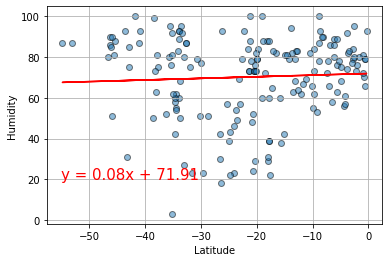


##### Latitude vs. Humidity Linear Regression (Southern Hemisphere) Analysis
Linear regression shows only slight relationship and r-squared value is very low, both indicating very little relationship between humidity and latitude. 

####  Northern Hemisphere - Cloudiness (%) vs. Latitude Linear Regression


```python
# Set x and y values
x_values = northern_hemisphere['Lat']
y_values = northern_hemisphere['Cloudiness']

# Calculate linear regression, line equation and r squared
(slope, intercept, rvalue, pvalue, stderr) = stats.linregress(x_values, y_values)
regress_values = x_values * slope + intercept
line_eq = "y = " + str(round(slope,2)) + "x + " + str(round(intercept,2))
r_squared = rvalue**2

# Create scatter plot with line equation
plt.scatter(x_values, y_values, alpha=.5, color='grey', edgecolors='black')
plt.plot(x_values,regress_values,"r-")
plt.annotate(line_eq,(10,55),fontsize=15,color="red")
plt.grid()
plt.xlabel('Latitude')
plt.ylabel('Cloudiness')
print(f"The r-squared is: {rvalue**2}")
plt.show()
```

    The r-squared is: 0.012920415144712531


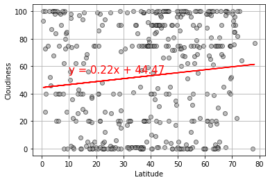


##### Latitude vs. Cloudiness Linear Regression (Northern Hemisphere) Analysis
Linear regression shows only slight relationship and r-squared value is very low, both indicating very little relationship between humidity and latitude. 

####  Southern Hemisphere - Cloudiness (%) vs. Latitude Linear Regression


```python
# Set x and y values
x_values = southern_hemisphere['Lat']
y_values = southern_hemisphere['Cloudiness']

# Calculate linear regression, line equation and r squared
(slope, intercept, rvalue, pvalue, stderr) = stats.linregress(x_values, y_values)
regress_values = x_values * slope + intercept
line_eq = "y = " + str(round(slope,2)) + "x + " + str(round(intercept,2))
r_squared = rvalue**2

# Create scatter plot with line equation
plt.scatter(x_values, y_values, color='grey', alpha=.5, edgecolors='black')
plt.plot(x_values,regress_values,"r-")
plt.annotate(line_eq,(-55,65),fontsize=15,color="red")
plt.grid()
plt.xlabel('Latitude')
plt.ylabel('Cloudiness')
print(f"The r-squared is: {rvalue**2}")
plt.show()
```

    The r-squared is: 0.06386158914569139


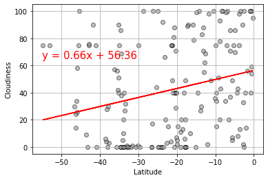


##### Latitude vs. Cloudiness Linear Regression (Southern Hemisphere) Analysis
Linear regression shows more of a relationship between cloudiness and latitude: as latitude goes down towards South Pole, cloudiness goes down. R-squared value is very low.

####  Northern Hemisphere - Wind Speed (mph) vs. Latitude Linear Regression


```python
# Set x and y values
x_values = northern_hemisphere['Lat']
y_values = northern_hemisphere['WindSpeed']

# Calculate linear regression, line equation and r squared
(slope, intercept, rvalue, pvalue, stderr) = stats.linregress(x_values, y_values)
regress_values = x_values * slope + intercept
line_eq = "y = " + str(round(slope,2)) + "x + " + str(round(intercept,2))
r_squared = rvalue**2

# Create scatter plot with line equation
plt.scatter(x_values, y_values, alpha=.5, color='purple', edgecolors='black')
plt.plot(x_values,regress_values,"r-")
plt.annotate(line_eq,(10,40),fontsize=15,color="red")
plt.grid()
plt.xlabel('Latitude')
plt.ylabel('Wind Speed')
print(f"The r-squared is: {rvalue**2}")
plt.show()
```

    The r-squared is: 0.007530847387540433


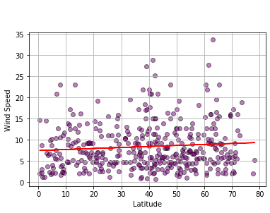


##### Latitude vs. Wind Speed Linear Regression (Northern Hemisphere) Analysis
Linear regression shows only slight relationship and r-squared value is very low, both indicating very little relationship between humidity and latitude. 

####  Southern Hemisphere - Wind Speed (mph) vs. Latitude Linear Regression


```python
# Set x and y values
x_values = southern_hemisphere['Lat']
y_values = southern_hemisphere['WindSpeed']

# Calculate linear regression, line equation and r squared
(slope, intercept, rvalue, pvalue, stderr) = stats.linregress(x_values, y_values)
regress_values = x_values * slope + intercept
line_eq = "y = " + str(round(slope,2)) + "x + " + str(round(intercept,2))
r_squared = rvalue**2

# Create scatter plot with line equation
plt.scatter(x_values, y_values, color='grey', alpha=.5, edgecolors='black')
plt.plot(x_values,regress_values,"r-")
plt.annotate(line_eq,(-55, 20),fontsize=15,color="red")
plt.grid()
plt.xlabel('Latitude')
plt.ylabel('Wind Speed')
print(f"The r-squared is: {rvalue**2}")
plt.show()
```

    The r-squared is: 0.004168720594869873


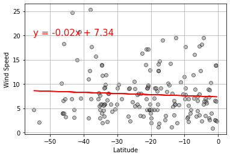


##### Latitude vs. Cloudiness Linear Regression (Southern Hemisphere) Analysis
Linear regression shows only slight relationship and r-squared value is very low, both indicating very little relationship between humidity and latitude. 


```python

```
